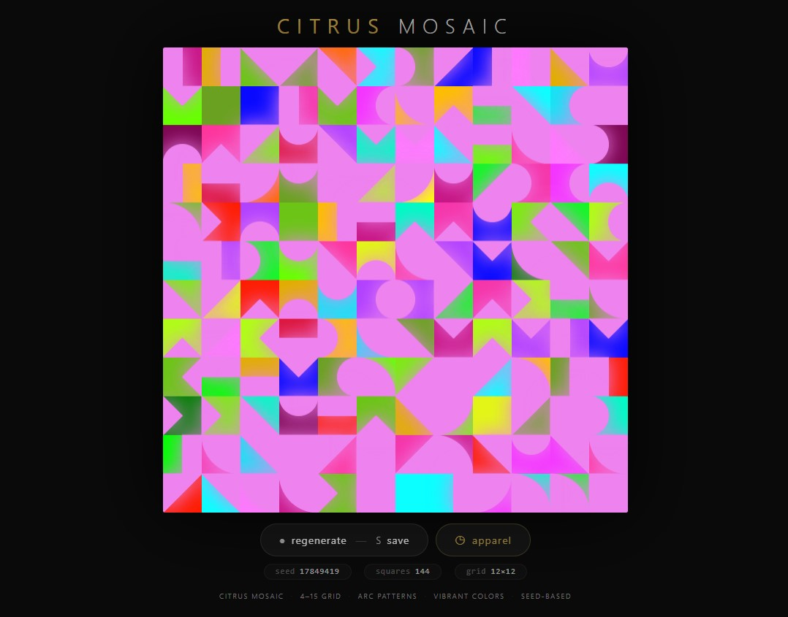
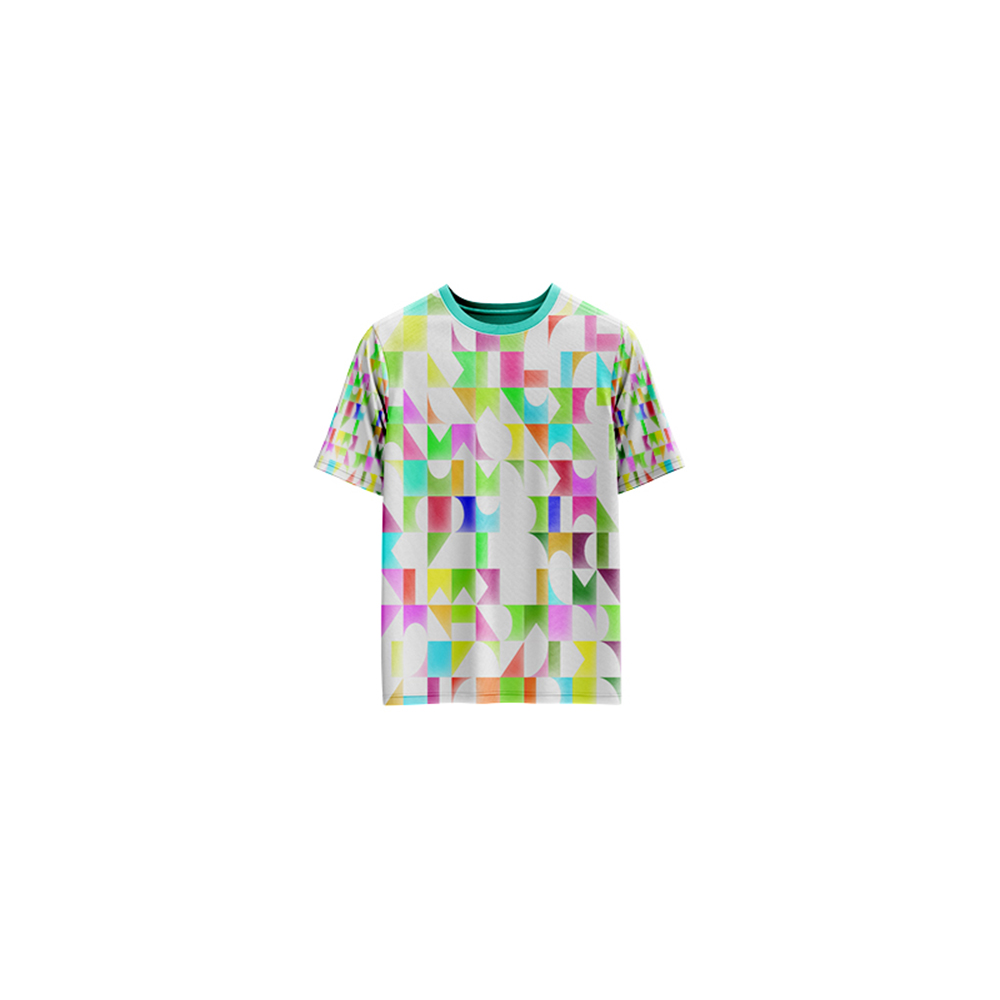

# Citrus Mosaic — Generative Art

[](https://reyrove.github.io/Citrus-Mosaic-Generative-Art)
[](https://opensource.org/licenses/MIT)

> **Generative mosaic art with arc patterns.** Each refresh creates a unique grid of vibrant geometric shapes and arc patterns with glowing accents, inspired by citrus colors and mosaic tiles.

## 🎨 Live Demo

<div align="center">
  <a href="https://reyrove.github.io/Citrus-Mosaic-Generative-Art" target="_blank">
    
  </a>
  <br><br>
  <a href="https://reyrove.github.io/Citrus-Mosaic-Generative-Art" target="_blank">
    
  </a>
  <br>
  <em>Click the image or button to experience the generative art</em>
</div>

## 👕 Apparel Preview

<div align="center">
  
  <br>
  <em>Citrus Mosaic artwork printed on a T-shirt</em>
</div>

## ✨ Features

- **Mosaic Grid** — 2×2 to 15×15 grid of geometric patterns
- **21 Arc Patterns** — Unique geometric shapes and arc designs
- **Vibrant Colors** — 27 square colors + 22 foreground colors
- **Glow Effect** — Soft shadow glow on arc patterns
- **Seed-Based** — Every composition is unique and reproducible via its seed
- **Save & Share** — Download as PNG with seed in filename
- **Apparel Mode** — Preview artwork on a T-shirt mockup
- **Responsive** — Works on desktop, tablet, and mobile
- **Pure JavaScript** — No external dependencies
- **Keyboard Shortcuts**:
  - `R` — Regenerate
  - `S` — Save image
  - `T` — Toggle apparel view

## 🎨 Artwork Details

| Parameter | Range | Description |
|-----------|-------|-------------|
| **Grid Size** | 2×2 to 15×15 | Mosaic grid dimensions |
| **Total Squares** | 4 to 225 | Number of mosaic tiles |
| **Arc Patterns** | 21 options | Unique geometric shapes |
| **Square Colors** | 27 options | Vibrant tile colors |
| **Foreground Colors** | 22 options | Arc pattern colors |

## 🎯 Arc Patterns

The artwork features 21 different arc patterns including:
- Quarter circles in corners
- Triangles and polygons
- Half circles on edges
- Centered arcs
- Rectangular divisions
- And more unique geometric shapes

## 🚀 Quick Start

### Local Development

```bash
# Clone the repository
git clone https://github.com/reyrove/Citrus-Mosaic-Generative-Art.git

# Navigate to the directory
cd Citrus-Mosaic-Generative-Art

# Open in browser
open index.html
# or use a live server
```

### Deploy to GitHub Pages

1. Push to GitHub
2. Go to Settings → Pages
3. Select branch `main` and root folder
4. Your site will be live at `https://reyrove.github.io/Citrus-Mosaic-Generative-Art`

## 🧠 How It Works

The artwork is generated using a deterministic random number generator, seeded by timestamp + random noise. Every refresh:

1. **Setup**:
   - Chooses a random foreground color from 22 options
   - Determines grid size (2-15)
   - Creates random colors for each square from 27 options

2. **Pattern Generation**:
   - Each square gets a random arc pattern (1 of 21 types)
   - Patterns include arcs, triangles, polygons, and more
   - Each pattern is drawn with glowing foreground color

3. **Rendering**:
   - Black background with vibrant mosaic tiles
   - Each tile has a unique color
   - Arc patterns glow with shadow effect
   - Grid creates a cohesive mosaic artwork

## 📁 File Structure

```
Citrus-Mosaic-Generative-Art/
├── index.html          # Main application (all-in-one)
├── Citrus-Mosaic.jpg   # T-shirt mockup image
├── fav.svg             # Favicon
├── demo-screenshot.jpg # Website demo screenshot
├── README.md           # This file
└── LICENSE             # MIT License
```

## 🛠️ Tech Stack

- **Pure Vanilla HTML/CSS/JS** — No dependencies
- **Canvas API** — 2D rendering
- **CSS Flexbox/Grid** — Responsive layout
- **GitHub Pages** — Hosting

## 🎯 Interactive Controls

| Action | Keyboard | Button |
|--------|----------|--------|
| Regenerate | `R` | Click "regenerate" |
| Save Image | `S` | Click "regenerate" |
| Toggle Apparel | `T` | Click "apparel" |

## 🎨 The Creative Process

### Mosaic Grid
The artwork is built as a grid of squares, each acting as a tile in a larger mosaic. The grid size varies randomly between 2×2 and 15×15.

### Arc Patterns
Each tile contains one of 21 unique geometric patterns:
- Arc shapes in corners
- Triangles dividing the square
- Rectangular sections
- Half-circle arcs
- Polygonal shapes

### Color Palette
The vibrant color palette includes 27 square colors and 22 foreground colors, creating a citrus-inspired, energetic aesthetic.

### Glow Effect
Each arc pattern features a soft glow effect, adding depth and dimension to the mosaic.

## 📱 Responsive Design

The application automatically adapts to:
- Desktop screens
- Tablets
- Mobile phones
- Landscape orientation
- Various aspect ratios

## 🤝 Contributing

Contributions are welcome! Feel free to:
- Fork the repository
- Create a feature branch
- Submit a pull request

### Ideas for Contributions:
- New arc patterns
- Additional color palettes
- Animation features
- Interactive tile editing
- Performance optimizations

## 📄 License

MIT License — see [LICENSE](LICENSE) file for details.

## 🙏 Acknowledgments

- Inspired by mosaic art and citrus colors
- Pure JavaScript implementation
- Special thanks to the creative coding community

---

**Built with ❤️ and citrus vibes**